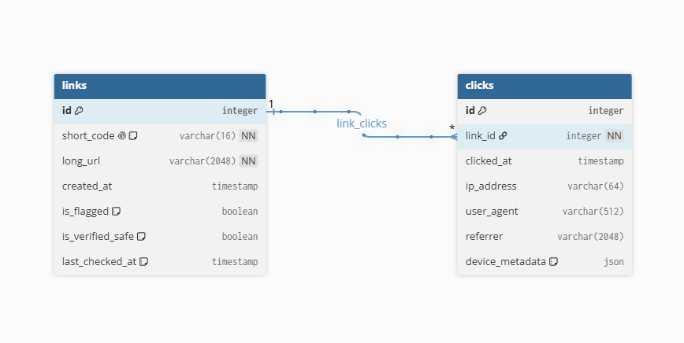

# LinkShield — simple link shortener backbone

Stack: Next.js (TypeScript) frontend, FastAPI backend, PostgreSQL.

## Structure
```
linkshield/
  backend/         FastAPI app
    app/
      main.py             endpoints: create link, list links, stats, redirect
      models.py           SQLAlchemy models (Link, Click)
      schemas.py          Pydantic request/response models
      database.py         DB session setup
      interfaces.py       Protocol contracts: SecurityCheck, TrackingSink
      dependencies.py     FastAPI Depends() providers — the DI wiring
      config.py           registry of available checks/trackers + which are active
      checks/
        ssrf_check.py       blocks private/internal IPs (cloud metadata, localhost, LAN)
        reputation_check.py stub for Safe Browsing / VirusTotal
        pipeline.py         runs a list of checks against a URL
      tracking/
        db_tracker.py        writes clicks to Postgres (always on)
        external_tracker.py  stub showing how to plug in an analytics API
    requirements.txt
  frontend/        Next.js app (App Router, TS, Tailwind)
    app/page.tsx    form to create links + list view
    lib/api.ts      fetch helpers for backend
  docker-compose.yml   Postgres for local dev
```

## Database


Two tables, one-to-many (`links` 1 — * `clicks`):

- **links** — `id`, `short_code` (unique, indexed), `long_url`, `created_at`, plus moderation/safety state: `is_flagged`, `is_verified_safe`, `last_checked_at` (used by the click-time re-validation described below).
- **clicks** — `id`, `link_id` (FK), `clicked_at`, `ip_address`, `user_agent`, `referrer`, and `device_metadata` (JSON) for the enriched click-tracking data (screen size, timezone, language, etc. — see the enriched click tracking section below for why this is a schema-less JSON blob rather than fixed columns).

## How the plug-and-play architecture works

Routes never call `SSRFCheck()` or `DBClickTracker()` directly. Instead they
declare what they need via FastAPI's `Depends()`:

```python
async def create_link(payload: ..., pipeline: SecurityPipeline = Depends(get_security_pipeline)):
    result = await pipeline.run(long_url)
```

`get_security_pipeline()` (in `dependencies.py`) builds the pipeline from
whatever's listed in `config.py`'s `ACTIVE_CHECKS`, which reads from an env
var (`ACTIVE_SECURITY_CHECKS=ssrf,reputation`). To add a new compliance
check later (say, a GDPR-region check or a copyright takedown check):

1. Write a class with an async `check(url) -> CheckResult` method (see `checks/ssrf_check.py`)
2. Add it to `SECURITY_CHECK_REGISTRY` in `config.py`
3. Add its name to the `ACTIVE_SECURITY_CHECKS` env var

No changes to `main.py`, no changes to other checks. Same pattern for
trackers via `TRACKER_FACTORIES` / `ACTIVE_TRACKERS` — add a `TrackingSink`
implementation (DB, analytics API, audit log) and toggle it on/off per
environment.

## Run it

**1. Start Postgres**
```bash
docker compose up -d
```


**2. Backend**
```bash
cd backend
python -m venv venv && source venv/bin/activate
pip install -r requirements.txt
cp .env.example .env   # edit if needed
uvicorn app.main:app --reload --port 8000
```
API docs at http://localhost:8000/docs

**3. Frontend**
```bash
cd frontend
npm install
cp .env.local.example .env.local
npm run dev
```
App at http://localhost:3000

## Endpoints
- `POST /api/links` — create a short link `{ long_url, custom_code? }`
- `GET /api/links` — list all links with click counts
- `GET /api/links/{short_code}/stats` — click stats for one link
- `GET /r/{short_code}` — redirect (runs safety re-check before forwarding)

## Security checks currently in place
- Scheme allowlist (only http/https)
- SSRF guard: resolves hostname and blocks private/loopback/link-local IP ranges (defends against links pointing at internal infra or cloud metadata endpoints)
- Flag system: `is_flagged` links are blocked at redirect time
- Click-time re-validation, not just creation-time (a link can go bad after it's made)
- `ReputationCheck` in `checks/reputation_check.py` is a stub — wire in Google Safe Browsing or VirusTotal here for real threat-intel checks

## Ideas to extend for the assignment
- Real reputation API call in `ReputationCheck.check()`
- A GDPR/compliance-region check as a new `SecurityCheck` implementation
- Rate limiting per IP/link on `/r/{short_code}`
- Admin view to review/unflag reported links
- Link expiry (`expires_at` column)
- QR code generation per link
- Auth-gated link creation (prevent anonymous phishing-link factory)

---

## Feature: enriched click tracking (device/browser/geo data)

### The problem

A plain server-side redirect (`GET /r/{code}` → HTTP 302) only ever exposes
whatever the browser sends in that one request: IP address, `User-Agent`
string, `Referer` header, timestamp. That's it. There's no way to get
screen size, timezone, viewport size, or anything else Umami-style
analytics tools show, because none of that exists until JavaScript actually
runs in the browser — and a server-side redirect never gives JS a chance to
run before the browser leaves for the destination.

### The design

To collect richer data, the short link has to land on an actual **page**
first (not an instant redirect), run a small script to collect enrichment
data, send it to the backend, and only then redirect:

```
User clicks short link
  → GET /go/{code}                 (Next.js page, our own domain)
  → is the User-Agent a known bot/crawler?
        YES → server-side redirect straight to /r/{code}  (old behavior, no JS needed)
        NO  → render interstitial ("Redirecting you safely...")
                → JS collects screen size, timezone, viewport, language
                → POST /api/links/{code}/click  with that metadata
                → backend re-runs SecurityPipeline, records click via all trackers
                → backend responds { redirect_url }
                → JS does window.location.replace(redirect_url)
```

### Why the bot branch exists

Link-preview bots (WhatsApp, Slack, iMessage generating a preview),
crawlers, and CLI tools (`curl`, monitoring scripts) never run JavaScript.
If `/go/{code}` only ever showed the JS interstitial, all of these would
see a blank page and never reach the real destination — a broken
experience for anything that isn't a full browser.

The fix: `/go/{code}` is a Next.js **server component**. Before rendering
anything, it reads the `User-Agent` header and checks it against a list of
known bot/crawler patterns (`lib/botDetection.ts` on the frontend,
`app/bot_detection.py` on the backend — same pattern, kept in sync
manually). Bots get an immediate `redirect()` straight to the old
`/r/{code}` endpoint, which behaves exactly as it did before this feature
existed. Only real browsers see the interstitial.

### Why `record_click()` takes a generic `metadata` dict, not named fields

The original `TrackingSink.record_click()` signature had one parameter per
known field (`ip_address`, `user_agent`, `referrer`). Enrichment data is
different: the list of what you might want to capture (screen size,
timezone, language today; maybe connection speed or color scheme
tomorrow) is expected to keep growing. If each new field became a new
named parameter, every `TrackingSink` implementation — `DBClickTracker`,
`ExternalAnalyticsTracker`, any future one — would need editing every time
someone wanted to track one more thing. That defeats the whole point of
the plug-and-play design from earlier.

Instead, `record_click()` takes `metadata: dict | None`. `DBClickTracker`
stores the whole dict as-is in a `JSON` column (`device_metadata` on the
`clicks` table) — no schema migration needed to add a new field, and
Postgres's `JSON`/`JSONB` support makes querying into it later
straightforward if needed. A future `ClickHouseTracker` could pick out a
different subset of the same dict without the two trackers ever needing
to agree on one fixed schema.

### What changed, concretely

**Backend**
- `models.py` — added `Click.device_metadata` (JSON column)
- `interfaces.py` — `TrackingSink.record_click()` gained a `metadata` parameter
- `tracking/db_tracker.py`, `tracking/external_tracker.py` — updated to accept and pass through `metadata`
- `bot_detection.py` — new; a regex-based `is_bot(user_agent)` check
- `schemas.py` — added `ClickMetadata` (the enrichment payload shape) and `ClickRedirectResponse`
- `main.py` — new endpoint `POST /api/links/{code}/click`: re-runs the security pipeline, records the click with metadata through every active tracker, returns `{ redirect_url }` as JSON (the frontend does the actual browser redirect, not the backend)
- The original `GET /r/{code}` is unchanged in behavior — it's now specifically the **bot/no-JS fallback path**, called either directly or via the frontend's bot short-circuit

**Frontend**
- `app/go/[code]/page.tsx` — server component; checks `User-Agent` via `headers()`, redirects bots to `/r/{code}` immediately, otherwise renders the interstitial
- `app/go/[code]/InterstitialRedirect.tsx` — client component; collects `screen.width/height`, `innerWidth/innerHeight`, `Intl` timezone, `navigator.language`, POSTs to the backend, then `window.location.replace()`s to the real URL
- `lib/botDetection.ts` — same bot-pattern check, frontend side
- `lib/api.ts` — `shortUrlFor()` now points at `{appBase}/go/{code}` (our own domain) instead of the raw backend `/r/{code}`, since the shared link should land on our page first

### Trade-off worth stating out loud in a presentation

This adds a redirect hop and a brief visible delay (typically under
300ms) for real users, in exchange for richer analytics data. It's a
deliberate trade, not a free upgrade — and it's also the natural place to
show a trust signal (e.g. "✓ verified safe") before continuing, which a
plain 302 redirect never had room for.
